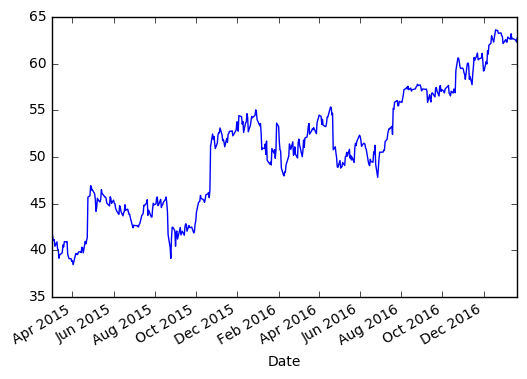

```python
# Importing liabraries and DataReader
import pandas as pd 
import pandas_datareader.data as web
import matplotlib.pyplot as plt 
import datetime
from datetime import date
```


```python
# Setting time range
start = date(2015,3,1)
end = date(2017,1,20)
```


```python
# Getting data for a stock
stock_price = web.DataReader("MSFT", "yahoo", start, end)
stock_price.tail(5)
```


<div>
<table border="1" class="dataframe">
  <thead>
    <tr style="text-align: right;">
      <th></th>
      <th>Open</th>
      <th>High</th>
      <th>Low</th>
      <th>Close</th>
      <th>Volume</th>
      <th>Adj Close</th>
    </tr>
    <tr>
      <th>Date</th>
      <th></th>
      <th></th>
      <th></th>
      <th></th>
      <th></th>
      <th></th>
    </tr>
  </thead>
  <tbody>
    <tr>
      <th>2017-01-13</th>
      <td>62.619999</td>
      <td>62.869999</td>
      <td>62.349998</td>
      <td>62.700001</td>
      <td>19350400</td>
      <td>62.700001</td>
    </tr>
    <tr>
      <th>2017-01-17</th>
      <td>62.680000</td>
      <td>62.700001</td>
      <td>62.029999</td>
      <td>62.529999</td>
      <td>20620400</td>
      <td>62.529999</td>
    </tr>
    <tr>
      <th>2017-01-18</th>
      <td>62.669998</td>
      <td>62.700001</td>
      <td>62.119999</td>
      <td>62.500000</td>
      <td>19646500</td>
      <td>62.500000</td>
    </tr>
    <tr>
      <th>2017-01-19</th>
      <td>62.240002</td>
      <td>62.980000</td>
      <td>62.200001</td>
      <td>62.299999</td>
      <td>18435500</td>
      <td>62.299999</td>
    </tr>
    <tr>
      <th>2017-01-20</th>
      <td>62.669998</td>
      <td>62.820000</td>
      <td>62.369999</td>
      <td>62.740002</td>
      <td>29467500</td>
      <td>62.740002</td>
    </tr>
  </tbody>
</table>
</div>


```python
stock_price["MA"] = stock_price["Adj Close"].rolling(window=100).mean()
stock_price.head()
# stock_price.tail()
```


<div>
<table border="1" class="dataframe">
  <thead>
    <tr style="text-align: right;">
      <th></th>
      <th>Open</th>
      <th>High</th>
      <th>Low</th>
      <th>Close</th>
      <th>Volume</th>
      <th>Adj Close</th>
      <th>MA</th>
    </tr>
    <tr>
      <th>Date</th>
      <th></th>
      <th></th>
      <th></th>
      <th></th>
      <th></th>
      <th></th>
      <th></th>
    </tr>
  </thead>
  <tbody>
    <tr>
      <th>2015-03-02</th>
      <td>43.669998</td>
      <td>44.189999</td>
      <td>43.549999</td>
      <td>43.880001</td>
      <td>31924000</td>
      <td>41.872106</td>
      <td>NaN</td>
    </tr>
    <tr>
      <th>2015-03-03</th>
      <td>43.560001</td>
      <td>43.830002</td>
      <td>43.090000</td>
      <td>43.279999</td>
      <td>31748600</td>
      <td>41.299559</td>
      <td>NaN</td>
    </tr>
    <tr>
      <th>2015-03-04</th>
      <td>43.009998</td>
      <td>43.209999</td>
      <td>42.880001</td>
      <td>43.060001</td>
      <td>25748700</td>
      <td>41.089628</td>
      <td>NaN</td>
    </tr>
    <tr>
      <th>2015-03-05</th>
      <td>43.070000</td>
      <td>43.240002</td>
      <td>42.820000</td>
      <td>43.110001</td>
      <td>23193500</td>
      <td>41.137339</td>
      <td>NaN</td>
    </tr>
    <tr>
      <th>2015-03-06</th>
      <td>43.000000</td>
      <td>43.110001</td>
      <td>42.150002</td>
      <td>42.360001</td>
      <td>36248800</td>
      <td>40.421658</td>
      <td>NaN</td>
    </tr>
  </tbody>
</table>
</div>


```python

stock_price["Adj Close"].plot()
plt.show()
```





```python
min_price = stock_price["Low"].min()
print(min_price)
```

    39.720001


```python
max_price = stock_price["High"].max()
print(max_price)
```

    64.099998


```python

```
