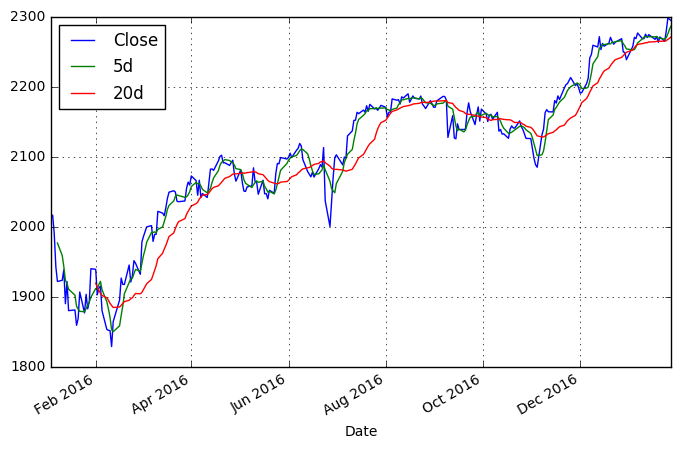
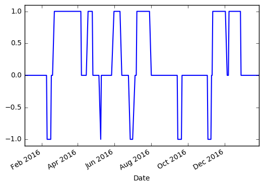
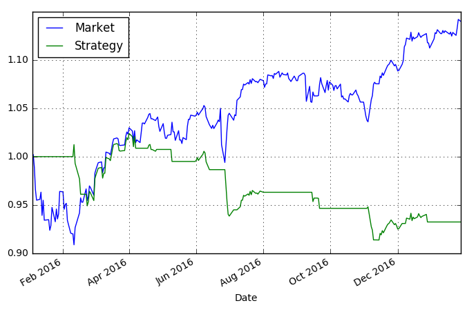

```python
import numpy as np 
import pandas as pd 
from pandas import DataFrame as df
import pandas_datareader.data as web
from datetime import date
import matplotlib.pyplot as plt
```


```python
sdate = date(2016,1,3)
edate = date(2017,1,27)

sp = web.DataReader('^GSPC','yahoo',sdate, edate)
sp.tail()
    
```


<div>
<table border="1" class="dataframe">
  <thead>
    <tr style="text-align: right;">
      <th></th>
      <th>Open</th>
      <th>High</th>
      <th>Low</th>
      <th>Close</th>
      <th>Volume</th>
      <th>Adj Close</th>
    </tr>
    <tr>
      <th>Date</th>
      <th></th>
      <th></th>
      <th></th>
      <th></th>
      <th></th>
      <th></th>
    </tr>
  </thead>
  <tbody>
    <tr>
      <th>2017-01-23</th>
      <td>2267.780029</td>
      <td>2271.780029</td>
      <td>2257.020020</td>
      <td>2265.199951</td>
      <td>3152710000</td>
      <td>2265.199951</td>
    </tr>
    <tr>
      <th>2017-01-24</th>
      <td>2267.879883</td>
      <td>2284.629883</td>
      <td>2266.679932</td>
      <td>2280.070068</td>
      <td>3810960000</td>
      <td>2280.070068</td>
    </tr>
    <tr>
      <th>2017-01-25</th>
      <td>2288.879883</td>
      <td>2299.550049</td>
      <td>2288.879883</td>
      <td>2298.370117</td>
      <td>3846020000</td>
      <td>2298.370117</td>
    </tr>
    <tr>
      <th>2017-01-26</th>
      <td>2298.629883</td>
      <td>2300.989990</td>
      <td>2294.080078</td>
      <td>2296.679932</td>
      <td>3610360000</td>
      <td>2296.679932</td>
    </tr>
    <tr>
      <th>2017-01-27</th>
      <td>2299.020020</td>
      <td>2299.020020</td>
      <td>2291.620117</td>
      <td>2294.689941</td>
      <td>3135890000</td>
      <td>2294.689941</td>
    </tr>
  </tbody>
</table>
</div>


```python
sp['5d'] = np.round(pd.Series(sp['Close']).rolling(window=5).mean(),2)
sp['20d'] = np.round(pd.Series(sp['Close']).rolling(window=20).mean(),2)
sp[['Close', '5d', '20d']].plot(grid=True, figsize=(8,5))
plt.show()
```





```python
# now we add new column for the differences between two trends
sp['5-20'] = sp['5d'] - sp['20d']
sp.tail()
```


<div>
<table border="1" class="dataframe">
  <thead>
    <tr style="text-align: right;">
      <th></th>
      <th>Open</th>
      <th>High</th>
      <th>Low</th>
      <th>Close</th>
      <th>Volume</th>
      <th>Adj Close</th>
      <th>5d</th>
      <th>20d</th>
      <th>5-20</th>
    </tr>
    <tr>
      <th>Date</th>
      <th></th>
      <th></th>
      <th></th>
      <th></th>
      <th></th>
      <th></th>
      <th></th>
      <th></th>
      <th></th>
    </tr>
  </thead>
  <tbody>
    <tr>
      <th>2017-01-23</th>
      <td>2267.780029</td>
      <td>2271.780029</td>
      <td>2257.020020</td>
      <td>2265.199951</td>
      <td>3152710000</td>
      <td>2265.199951</td>
      <td>2268.00</td>
      <td>2265.22</td>
      <td>2.78</td>
    </tr>
    <tr>
      <th>2017-01-24</th>
      <td>2267.879883</td>
      <td>2284.629883</td>
      <td>2266.679932</td>
      <td>2280.070068</td>
      <td>3810960000</td>
      <td>2280.070068</td>
      <td>2270.43</td>
      <td>2266.17</td>
      <td>4.26</td>
    </tr>
    <tr>
      <th>2017-01-25</th>
      <td>2288.879883</td>
      <td>2299.550049</td>
      <td>2288.879883</td>
      <td>2298.370117</td>
      <td>3846020000</td>
      <td>2298.370117</td>
      <td>2275.73</td>
      <td>2267.90</td>
      <td>7.83</td>
    </tr>
    <tr>
      <th>2017-01-26</th>
      <td>2298.629883</td>
      <td>2300.989990</td>
      <td>2294.080078</td>
      <td>2296.679932</td>
      <td>3610360000</td>
      <td>2296.679932</td>
      <td>2282.33</td>
      <td>2269.29</td>
      <td>13.04</td>
    </tr>
    <tr>
      <th>2017-01-27</th>
      <td>2299.020020</td>
      <td>2299.020020</td>
      <td>2291.620117</td>
      <td>2294.689941</td>
      <td>3135890000</td>
      <td>2294.689941</td>
      <td>2287.00</td>
      <td>2271.53</td>
      <td>15.47</td>
    </tr>
  </tbody>
</table>
</div>


```python
signal =20 #points 5d is above 20d
sp['System'] = np.where(sp['5-20'] > signal, 1, 0) #dates when 5d is greater then 20d and signal, marked with 1, go long, 0 = parked in cash
sp['System'] = np.where(sp['5-20'] < -signal, -1, sp['System']) #dates to go short
sp['System'].value_counts() #count number of 1, -1, 0 occurances 
```


     0    160
     1     91
    -1     19
    Name: System, dtype: int64


In words, 91 day 5dma lies more then 20 points above 20dma


```python
sp['System'].plot(lw=1.5)
plt.ylim([-1.1, 1.1]) #setting the limits of y-axis on matplotlib
plt.show()
```





```python
# calculating returns market vs strategy
 
sp['Market'] = np.log(sp['Close']/sp['Close'].shift(1))
sp['Market'].tail()

```


    Date
    2017-01-23   -0.002694
    2017-01-24    0.006543
    2017-01-25    0.007994
    2017-01-26   -0.000736
    2017-01-27   -0.000867
    Name: Market, dtype: float64


```python
sp['Strategy'] = sp['System'].shift(1) * sp['Market']
sp[['Market', 'Strategy']].cumsum().apply(np.exp).plot(grid=True, figsize=(8,5))
    
plt.show()
```





```python

```
